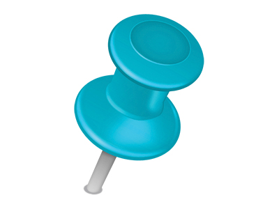

# Pin YOUR business



An AngularJS Qlik extension, prototyped by [Qlik](https://www.qlik.com), forked by databridge

---

- [Pre-requisites for contributors](#pre-requisites-for-contributors)
- [How to run PinIt locally](#how-to-run-pinit-locally)
- [How to run PinIt on the KW Qlik Sense Server](#how-to-run-pinit-on-the-kw-qlik-sense-server)
- [Qlik resources](#qlik-resources)
- [APIs and JS libraries](#apis-and-js-libraries)
- [Contacts](#contacts)

---

## Pre-requisites for contributors

- Install [Qlik Sense Desktop](https://www.qlik.com/us/try-or-buy/download-qlik-sense), you'll need to register for that
- Use your credentials when you start the Qlik Sense Desktop
- Install [Node.js](https://nodejs.org/en/) LTS (at the moment, we use node v8.11.0, which comes with npm 5.6.0)
- Follow [John Papa's AngularJS style guide](https://github.com/johnpapa/angular-styleguide/blob/master/a1/README.md)

## How to run PinIt locally

- Before building, run `npm install`, this downloads npm dependencies into `node_modules\`
- To **build**:
  - run `npm run build`, this lets webpack processes sources and resources into a `dist\` folder and packages the extension as `dist-zip\axpinme.zip`
  - alternatively run `npm run watch`, this lets webpack actively watch changes to sources and resources, and update `dist\` and `dist-zip\` on-the-fly
- To run with your own Qlik Desktop instance, simply add a symbolic link `axpinme` in `~\Documents\Qlik\Sense\Extensions` pointing to your `dist` folder, e.g. with Powershell:
  - run as Administrator: `New-Item -Path ~\Documents\Qlik\Sense\Extensions\axpinme -ItemType SymbolicLink -Value <cloned-git-repo>\dist\`
- Run and log into your Qlik Sense Desktop, then:
  - ensure some Apps in Qlik Sense Desktop have the `PinIt` keyword at the start of their description - see `PINIT.appKeyWord` value defined in [settings.js](./settings.js)
  - ensure some Visualizations Master Items used by these Apps have the `PinIt` tag at the start of their description - see `PINIT.appKeyWord` value defined in [settings.js](./settings.js)
  - browse to <http://localhost:4848/extensions/axpinme/index.html>, alternatively you can start the Dev Hub from the Qlik Sense Desktop, or directly hitting <http://localhost:4848/dev-hub>, then right-click and "view" the PinMe mashup

## How to run PinIt on the KW Qlik Sense Server

- To **build** the extension, run `npm run prod`
- To **deploy** the extension on our Qlik Sense Server:
  - Connect to the [Qlik Management Console](https://your-qlik-server/qmc/) with your K&W Software active directory account (e.g. KWSOFT1\pga)
  - Under `Manage Resources` / `Extensions`, click `Import`, then select the built `dist-zip\axpinme.zip`
    - NOTE: if the extension already exists, you must delete it first; be warned: it takes a while, a green confirmation messages comes after a while, no indication of any task in progress

- K&W **Qlik Sense Server** is <https://your-qlik-server.xx> (with chrome you don't need to add your credentials)
  - Qlik Management Console: <https://your-qlik-server.xx/qmc/>
  - DevHub: <https://your-qlik-server.xx/dev-hub/mashup-editor/#qext{axpinme}>
  - to test the **Pin Your business** extension: <https://your-qlik-server.xx/extensions/axpinme/index.html>


## Qlik resources

- [Getting started with DevHub Mashups](http://help.qlik.com/en-US/sense-developer/September2017/Subsystems/Dev-Hub/Content/Howtos/dev-hub-mashups-getting-started.htm)
- Check [Qlik and AngularJS](http://help.qlik.com/en-US/sense-developer/September2017/Subsystems/Extensions/Content/extensions-angular-introduction.htm) for interaction details between the two technology stacks
- [playground.qlik.com](http://playground.qlik.com/) is a programming environment to use, explore, and quickly test your  application ideas using Qlik technology
- see [supported browsers](http://help.qlik.com/en-US/sense/September2017/Subsystems/PlanningQlikSenseDeployments/Content/Introduction/supported-browsers.htm)

Some examples on Github:

- [Sense angular directives](https://github.com/stefanwalther/sense-angular-directives)
- [Helpdesk angular](https://github.com/erikwett/helpdesk-angular)
- [QlikSense Angular Demo](https://github.com/thomasfriebel/QlikSenseAngularDemo)
- [Qlik Mashup AngularJS bootstrap](https://github.com/pouc/qlik-mashup-angularjs-bootstrap) is a simple Qlik Sense mashup that uses angularjs and bootstrap + requirejs, can be used as a reference

## APIs and JS libraries

### [Capability APIs](http://help.qlik.com/en-US/sense-developer/September2017/Subsystems/APIs/Content/capability-apis-reference.htm)

JS APIs to embed Qlik Sense content into a web page. Dependent on AngularJS and RequireJS, so you will need to take this into consideration when integrating the Capability APIs into an existing project that also uses these libraries.

For instance:

- Get Current User

```javascript
const userData;
require( ["js/qlik"], function ( qlik ) {
    qlik.getGlobal(config).getAuthenticatedUser(function(reply){
        userData = 'User:'+reply.qReturn;
    });
});
```

- Personal Mode vs. Server Mode

Qliksense Desktop and Server differ by small but crucial details. For instance, to open applications, Qliksense Desktop uses app names whereas Qliksense Server uses the app IDs:

```javascript
const global = qlik.getGlobal(config);
const isPersonalMode;
global.isPersonalMode(function(reply) {
    isPersonalMode = reply.qReturn;
    if (isPersonalMode) {
        const app = qlik.openApp('Axon CIA Mashup.qvf', config);
    } else {
        const app = qlik.openApp('ee21d6ca-8d01-42c4-951d-dd294a8372cf', config);
    }
});
```

- [getObject](http://help.qlik.com/en-US/sense-developer/September2017/Subsystems/APIs/Content/CapabilityAPIs/AppAPI/getObject-method.htm)

Retrieves a Qlik Sense object from the Qlik Sense application and inserts it into a HTML element. The object fills the HTML object, so you can size and position the element to determine how large the Qlik Sense object will be. See <http://help.qlik.com/en-US/sense-developer/September2017/>

### [Qlik Engine API](http://help.qlik.com/en-US/sense-developer/September2017/Subsystems/EngineAPI/Content/introducing-engine-API.htm)

A JSON WebSocket protocol between the Qlik Sense engine and the clients. It consists of a set of objects representing apps, lists, etc. organized in a hierarchical structure. When you send requests to the API, you perform actions on these objects.

TEST Engine API => Start Qliksense Desktop => Open Web Browser

<http://localhost:4848/dev-hub/engine-api-explorer>

- List Apps: <http://help.qlik.com/en-US/sense-developer/June2017/Subsystems/EngineAPI/Content/Classes/GlobalClass/Global-class-GetDocList-method.htm>

### [Enigma.js library](https://github.com/qlik-oss/enigma.js/)

A client library that communicates with Qlik Sense backend services. It can be used in a browser or in a Node.js environment. You can use enigma.js as an SDK or do CRUD (that is create, read, update and delete) operations on apps and on app entities. You can also use it to build your own client or to build your own Node.js service. enigma.js can be used with both Qlik Sense and Qlik Sense Desktop.

For more details see an [introduction](https://help.qlik.com/en-US/sense-developer/September2017/Subsystems/APIs/Content/enigmajs/enigmajs-introduction.htm) and some [examples](http://help.qlik.com/en-US/sense-developer/September2017/Subsystems/APIs/Content/enigmajs/enigmajs-examples.htm)

- create Bookmark with enigma

```javascript
enigmaModel.createBookmark(bookmarkProperties).then((layout) => {
    //PAM: Qliksense Dekstop requires explicit saving of the App
    const isPersonalMode;
    global.isPersonalMode(function (reply) {
        isPersonalMode = reply.qReturn;
        if (isPersonalMode) {
            console.log('Personal Mode!');
            enigmaModel.doSave();
        }
    });
});
```

- apply bookmark

```javascript
enigmaModel.applyBookmark(qId).then((layout) => {
    console.log(layout);
});
```

## Contacts

- [databridge](https://www.databridge.ch): [Patric Amatulli](mailto:patric.amatulli@databridge.ch)
- 
